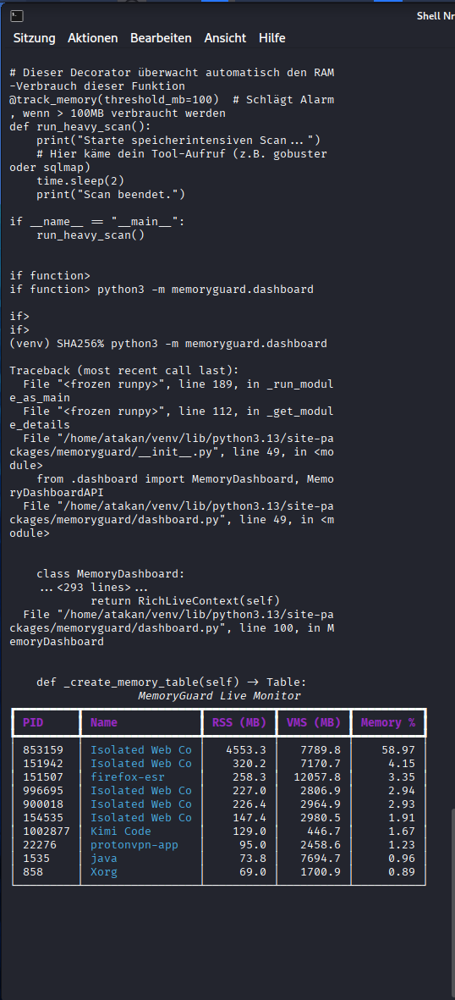

# 🔍 MemoryGuard

> **Like Lego for your Code** - Modular Python Memory Monitoring & Valgrind Integration

[](https://github.com/SHAdd0WTAka/memoryguard/actions/workflows/tests.yml)
[](https://github.com/SHAdd0WTAka/memoryguard/actions/workflows/coverage.yml)
[](https://github.com/SHAdd0WTAka/memoryguard/actions/workflows/docker.yml)
[](https://pypi.org/project/memoryguard/)
[](https://pypi.org/project/memoryguard/)
[](https://opensource.org/licenses/MIT)
[](https://ghcr.io/shadd0wtaka/memoryguard)

Drop-in memory monitoring for any Python project. Track memory usage, detect leaks, profile tools, and integrate with Valgrind - all with minimal overhead.

## ✨ Features

- 🎯 **Zero Config** - Works out of the box
- 📊 **Real-time Monitoring** - Live memory tracking
- 🔍 **Leak Detection** - Automatic leak identification  
- 🛠️ **Tool Profiling** - Per-function memory analysis
- 📺 **Live Dashboard** - Beautiful terminal UI (optional)
- 🔧 **Valgrind Integration** - Deep C-extension analysis
- 🚀 **CI/CD Ready** - GitHub Actions integration
- 🧩 **Modular** - Use only what you need

## 🚀 Quick Start

```bash
pip install memoryguard
```

### Basic Usage

```python
from memoryguard import MemoryGuard, track_memory

# Initialize
guard = MemoryGuard(threshold_mb=500)

# Track any function
@track_memory("heavy_computation", guard)
def heavy_computation():
    return sum(i**2 for i in range(1000000))

result = heavy_computation()

# Check memory manually
alert = guard.check_memory("after_computation")
if alert:
    print(f"⚠️  {alert.message}")
```

### Context Manager

```python
from memoryguard import memory_context

with memory_context("database_query", guard):
    # Your code here
    large_dataset = fetch_data()
    process(large_dataset)
# Memory automatically tracked
```

### Live Dashboard

```python
from memoryguard import MemoryDashboard

dashboard = MemoryDashboard(guard)

with dashboard.live_display():
    # Your long-running operation
    run_big_analysis()
```

## 🧩 Integration Patterns

### Pattern 1: Decorator (Simplest)

```python
from memoryguard import track_memory, get_memory_guard

guard = get_memory_guard(threshold_mb=1000)

@track_memory("my_function", guard)
def my_function():
    pass
```

### Pattern 2: Class Inheritance (For Tools)

```python
from memoryguard import MemoryInstrumentedTool

class MyScanner(MemoryInstrumentedTool):
    tool_name = "myscanner"
    
    def scan(self, target):
        with self.memory_context(target):
            return self.do_scan(target)
```

### Pattern 3: Orchestrator (For Workflows)

```python
from memoryguard import MemoryAwareOrchestrator

orchestrator = MemoryAwareOrchestrator(max_memory_mb=2000)
orchestrator.register_tool(my_tool)

result = await orchestrator.execute_with_memory_control(
    "my_tool", target, my_tool.scan(target)
)
```

## 📊 Dashboard

If you have `rich` installed:

```bash
pip install memoryguard[dashboard]
```

### Live Dashboard Preview



*Live memory monitoring with top processes, RSS/VMS usage, and memory percentage*

```python
from memoryguard import MemoryDashboard

dashboard = MemoryDashboard(guard)

# Simple text output
print(dashboard.get_simple_display())
# [Memory: 456.3MB | Status: OK | Alerts: 0]

# Or live display
with dashboard.live_display():
    run_analysis()
```

Shows:
- Live memory graph (sparkline)
- RSS/VMS usage
- Recent alerts
- Tool breakdown
- Progress bars

## 🔧 Valgrind Integration

For C-extension analysis:

```python
from memoryguard import ValgrindWrapper

wrapper = ValgrindWrapper()

if wrapper.available:
    result = wrapper.check_python_module(
        "my_c_extension",
        timeout=300
    )
    print(result['valgrind_log'])
```

## 🚀 CI/CD Integration

### GitHub Actions

```yaml
name: Memory Check

on: [push, pull_request]

jobs:
  memory-test:
    runs-on: ubuntu-latest
    steps:
    - uses: actions/checkout@v3
    - uses: actions/setup-python@v4
      with:
        python-version: '3.11'
    
    - name: Install
      run: pip install memoryguard
    
    - name: Run with Memory Tracking
      run: |
        python -c "
        from memoryguard import MemoryGuard
        guard = MemoryGuard()
        # ... your code ...
        guard.generate_report('memory-report.json')
        "
    
    - name: Upload Report
      uses: actions/upload-artifact@v3
      with:
        name: memory-report
        path: memory-report.json
```

## 📈 Advanced Usage

### Memory-Efficient Batch Processing

```python
from memoryguard import memory_efficient_batch

async def process_targets(targets):
    async def scan_batch(batch):
        return [await scan(t) for t in batch]
    
    return await memory_efficient_batch(
        targets,
        scan_batch,
        batch_size=10
    )
```

### Leak Detection

```python
# Reset baseline
guard.reset_baseline()

# Run your code
suspected_leaky_function()

# Check for leaks
leak_report = guard.detect_leaks("my_function")
if leak_report:
    print(f"Leaked: {leak_report['total_leaked_mb']}MB")
```

### Force Garbage Collection

```python
stats = guard.force_gc()
print(f"Freed {stats['memory_freed_mb']:.1f}MB")
print(f"Collected {stats['objects_collected']} objects")
```

## ⚙️ Configuration

```python
guard = MemoryGuard(
    threshold_mb=500,           # Warning threshold
    critical_threshold_mb=1000,  # Critical threshold  
    check_interval=30,           # Background check interval (seconds)
    enable_snapshots=True,       # Store history
    log_dir="~/.memoryguard/logs"  # Report location
)
```

## 🧪 Testing

```bash
# Install dev dependencies
pip install memoryguard[dev]

# Run tests
pytest tests/ -v

# With coverage
pytest tests/ --cov=memoryguard

# Benchmarks
pytest tests/ --benchmark-only
```

## 📁 Project Structure

```
memoryguard/
├── memoryguard/
│   ├── __init__.py          # Main exports
│   ├── core.py              # MemoryGuard, Valgrind
│   ├── integration.py       # Tool integration
│   └── dashboard.py         # TUI (requires rich)
├── tests/
│   └── test_memoryguard.py
├── examples/
│   └── demo.py
├── pyproject.toml
└── README.md
```

## 🤝 Usage in Other Projects

### As Git Submodule

```bash
git submodule add https://github.com/SHAdd0WTAka/memoryguard.git third_party/memoryguard
```

### As Local Package

```bash
# Clone anywhere
git clone https://github.com/SHAdd0WTAka/memoryguard.git

# Install in editable mode
pip install -e ./memoryguard
```

### Copy-Paste (Single File)

Just copy `memoryguard/core.py` to your project - it's self-contained!

## 📝 Requirements

- Python 3.8+
- psutil
- Optional: rich (for dashboard)
- Optional: valgrind (for C analysis)

## 📄 License

MIT License - see LICENSE file

## 🙏 Credits

Created for CLAWDBOT / Zen-AI-Pentest - now available for everyone!

---

**Like Lego for your Code** 🔧🧱 - Just drop it in and go!
